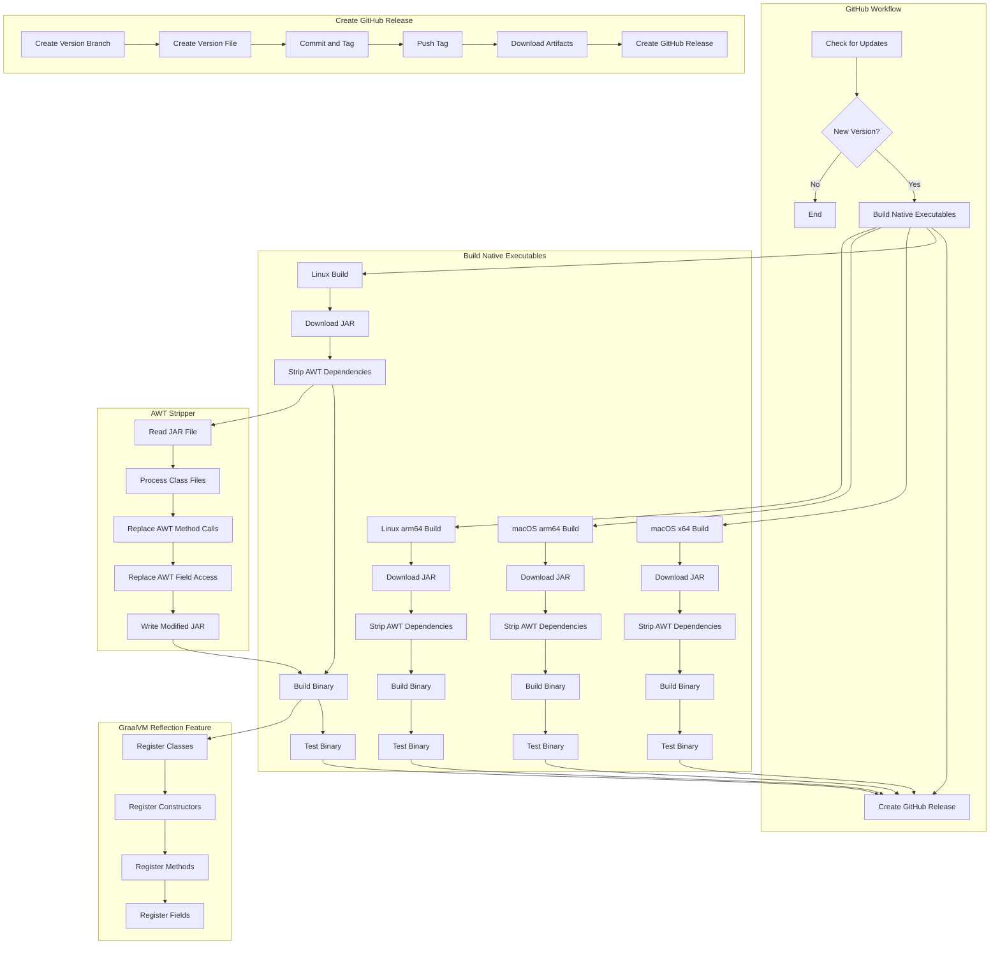

# System Patterns: Crowdin CLI Standalone

## System Architecture

The project consists of several components:

1. **GitHub Workflow for Building and Releasing**
   - Checks for new Crowdin CLI versions
   - Builds native executables using GraalVM
   - Creates GitHub releases with these executables
   - Uses a matrix strategy for building on different platforms
   - Supports manual version releases through workflow dispatch
   - Uses GitHub Script with Octokit for version checking
   - Uses `softprops/action-gh-release` for creating GitHub releases

2. **AWT Stripper**
   - A Java tool that removes AWT dependencies from the Crowdin CLI JAR
   - Uses ASM for bytecode manipulation
   - Replaces AWT method calls with exceptions
   - Improves compatibility in headless environments

3. **GraalVM Reflection Feature**
   - A Java class that registers classes for reflection in GraalVM
   - Ensures that required classes are available at runtime
   - Improves compatibility and reduces issues with reflection

4. **Test Project**
   - A sample Crowdin project for testing the built binaries
   - Verifies that the binaries work correctly
   - Tests various Crowdin CLI commands

## Key Technical Decisions

1. **Native Executables vs. JAR Files**
   - Using GraalVM to create native executables for better performance and simpler usage
   - Eliminates the need for Java runtime on the user's system

2. **AWT Dependency Removal**
   - Using a custom tool to remove AWT dependencies from the JAR
   - Improves compatibility in headless environments
   - Reduces binary size

3. **GraalVM Reflection Feature**
   - Using a custom GraalVM feature to register classes for reflection
   - Ensures that required classes are available at runtime
   - Improves compatibility and reduces issues with reflection

4. **GitHub Releases for Distribution**
   - Using GitHub releases to store and distribute the executables
   - Provides versioning and easy access to specific versions
   - Simplifies version checking and management

5. **Matrix Strategy for Builds**
   - Using GitHub Actions matrix strategy to define build configurations
   - Improves maintainability and scalability
   - Makes it easier to add new platforms or architectures

6. **Octokit for GitHub API Interactions**
   - Using Octokit for GitHub API interactions
   - Provides better type safety and error handling
   - Simplifies API calls and response handling

7. **GitHub Script for Workflow Operations**
   - Using GitHub Script for workflow operations
   - Simplifies the workflow by allowing JavaScript code directly in the workflow
   - Provides better error handling and logging

8. **Testing Strategy**
   - Testing each binary on its native platform immediately after building
   - Using a sample Crowdin project for testing
   - Verifying that various Crowdin CLI commands work correctly

## Component Relationships

- The GitHub workflow builds native executables and creates GitHub releases
- The AWT stripper removes AWT dependencies from the JAR
- The GraalVM reflection feature registers classes for reflection
- The test project verifies that the binaries work correctly
- The workflow uses matrix jobs for building on different platforms
- The workflow uses GitHub Script for version checking and `softprops/action-gh-release` for creating releases

## Error Handling Patterns

1. **Version Fallback**
   - If requested version is not available, fall back to latest version
   - Provide clear error messages and warnings

2. **Build Failure Handling**
   - Individual matrix job failures don't fail the entire workflow
   - Allows for partial success and reporting

3. **API Error Handling**
   - Use try/catch blocks for API calls
   - Provide clear error messages for API failures
   - Log detailed error information for debugging

4. **AWT Replacement**
   - Replace AWT method calls with exceptions that provide clear error messages
   - Ensure that users understand why certain commands are not supported 